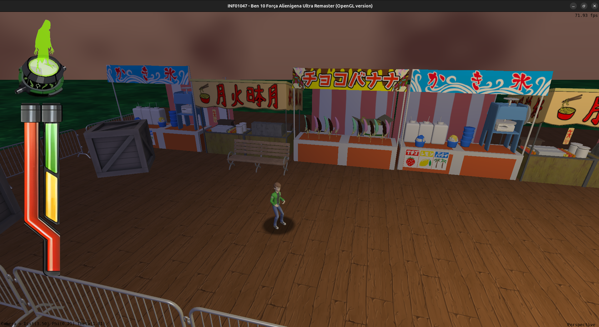
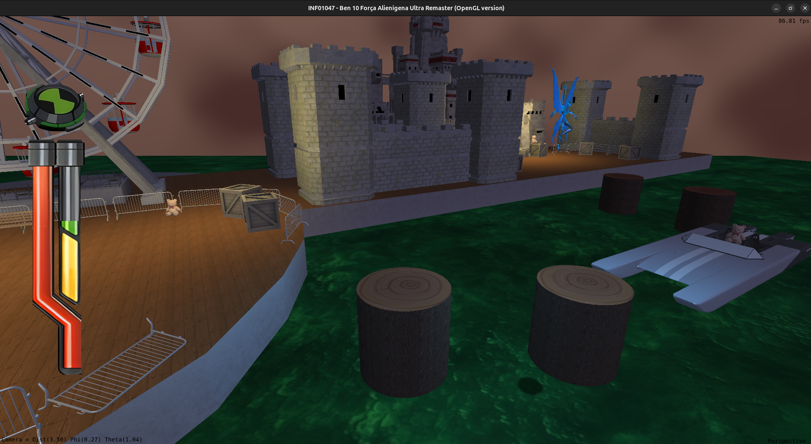
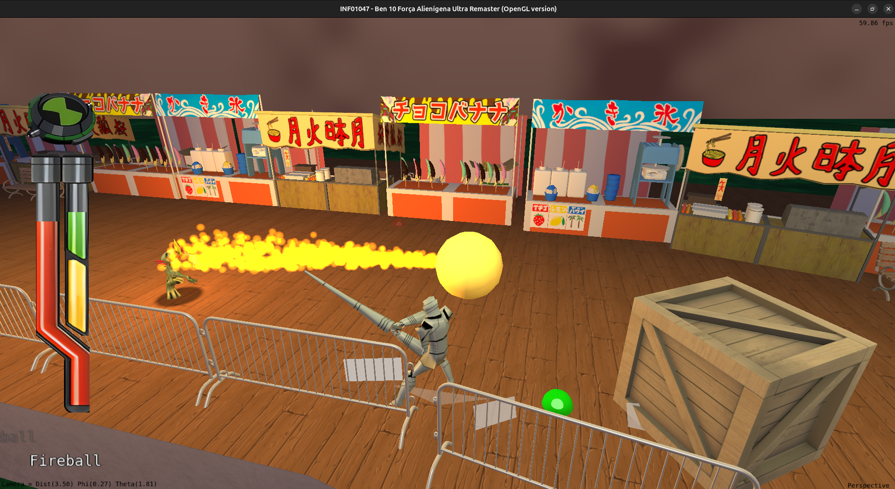

# Relatório Final - Computação Gráfica e Visualização (INF01047)

**Nomes:** Pedro Henrique Moreira de Andrade Jacinto e João Pedro Simon Figueiró

>Este relatório tem como finalidade descrever o processo de desenvolvimento do nosso jogo, **Ben 10 Força Alienígena Ultra Remaster (OpenGL version)**.

## Descrição da Aplicação
O nosso jogo, *Ben 10 Força Alienígena Ultra Remaster (OpenGL version)*, é inspirado em *Ben 10 Alien Force*, um jogo estilo *beat 'em up* de Playstation 2 em que controlamos o jovem Ben Tennyson. Graças ao Omnitrix, ele possui a capacidade de se transformar em diferentes aliens, derrotar vários inimigos e proteger a Terra. Nossa aplicação procurou adaptar uma porção da primeira fase do jogo original: *Knight-mare at the Pier*. Temos uma ambientação adaptada, mas mantendo a essência da fonte. Elementos como uma roda gigante e barraquinhas são dispostos ao longo da fase, levando a uma seção de plataforma na qual o jogador deve pular entre troncos e um barco para alcançar o castelo. O objetivo do jogo é percorrer o mapa, derrotar inimigos e chegar ao final da fase usando as transformações alienígenas, onde Ben enfrenta um desafio final em frente ao castelo dos Cavaleiros Eternos. Após derrotar todos os inimigos próximos ao castelo, Ben consegue completar a fase e vencer o jogo.

## Manual do usuário

### Câmeras
Por padrão, o jogo apresenta várias câmeras fixas, entre as quais o jogador alterna conforme avança na fase. Também existe uma câmera em terceira pessoa que acompanha o jogador, que é controlável. É possível trocar entre o modo de câmeras fixas e a câmera em terceira pessoa a qualquer momento.

### Controles

|              Ação              | Teclado |                           Gamepad                           |
| :----------------------------: | :-----: | :---------------------------------------------------------: |
|          Movimentação          |   WASD  |                      Analógico esquerdo                     |
| Controle da câmera (3ª pessoa) |  Mouse  |                      Analógico direito                      |
|              Pulo              |  Espaço |                  A (Xbox) / X (PlayStation)                 |
|          Ataque básico         |    E    |                  X (Xbox) / □ (PlayStation)                 |
|         Ataque especial        |    Q    |                  Y (Xbox) / △ (PlayStation)                 |
|  Transformar / Destransformar  |    Z    |                 RB (Xbox) / R1 (PlayStation)                |
|  Trocar alienígena selecionado |    X    | D-Pad esquerdo/direito / LB-RB (Xbox) / L1-R1 (PlayStation) |
|           Emote (Ben)          |    G    |                 RS (Xbox) / R3 (PlayStation)                |
|          Trocar câmera         |    C    |             Select (Xbox) / Share (PlayStation)             |
|            Confirmar           |  Enter  |                            Start                            |

### Mecânicas do jogo
#### Barras
- A **barra vermelha** representa a vida de Ben. Se ela acabar, Ben morrerá e o jogador terá que reiniciar a fase. Além disso, abaixo do mapa, encontra-se um mar tóxico que mata instantaneamente qualquer um que cair nele;
- A **barra verde** representa a  energia de transformação de Ben. O jogador pode controlar Ben e duas de suas transformações alienígenas: *Swampfire* e *Big Chill*. Para se transformar, o jogador deve estar com sua barra de transformação cheia. Essa barra diminui enquanto Ben está transformado, e pode forçar a destransformação caso se esgote;
- A **barra amarela** representa a energia especial de Ben e de suas transformações. Cada ataque especial consome energia especial, e a barra se regenera com o tempo.
#### Ataques e habilidades
- Cada uma das formas jogáveis possui um ataque básico e um ataque especial, além de diferentes habilidades:
  - **Ben**: possui baixa resistência e ataques fracos. Seu ataque básico é um soco e seu ataque especial é um grande tapa. Ele pode se transformar em um dos aliens para ter acesso a ataques mais poderosos;
  - **Swampfire**: possui alta resistência. Seu ataque básico consiste em uma sequência de golpes e seu ataque especial permite lançar uma bola de fogo, cujo tamanho e dano aumentam conforme o jogador carrega o ataque;
  - **Big Chill**: possui resistência moderada. Seu ataque básico consiste em uma sequência de socos de curto alcance e seu ataque especial permite liberar um sopro gelado contínuo que dá dano leve a inimigos e os congela, deixando-os mais lentos. Também possui a habilidade de pulo duplo no ar.
#### Inimigos e obstáculos
- Inimigos serão encontrados pelo caminho: os Cavaleiros Eternos. Ao serem eliminados, derrubam orbes que regeneram o jogador. Eles vêm em duas variedades:
  - **Cavaleiro básico**: inimigo com ataques de curto alcance. É mais resistente;
  - **Cavaleiro *ranged***: inimigo que ataca à distância, lançando projéteis em arco. É mais lento e menos resistente.
- Ao longo do trajeto, Ben encontra objetos quebráveis: bancos, caixas e ursinhos de pelúcia. Eles podem ser destruídos para liberar orbes que regeneram sua barra de vida (vermelhos), transformação (verdes) ou energia especial (amarelos). 

## Compilação e execução
Para compilar e executar o projeto, siga os passos abaixo:
1. Certifique-se de ter o **CMake** instalado em seu sistema. Caso não tenha, você pode baixá-lo em: https://cmake.org/download/
2. Abra um terminal e navegue até o diretório raiz do projeto.
3. Crie um diretório de compilação:
   ```bash
   cmake -B build -S .
   ```
4. Execute o jogo com o seguinte comando:
   ```bash
   cmake --build build -- run
   ```

## Sobre a colisão
A colisão de todos os objetos do jogo estão sendo feitas tomando base uma estrutura AABB (Axis-Aligned Bounding Box). Em `include/struct.h` temos a definição de sua estrutura, sendo ela resumida em 2 vetores de posição, um para coordenadas máximas e outro para as mínimas. Quando criamos os objetos do mundo, sempre deixamos atrelados a eles uma *bbox* usando dessa estrutura, assim podendo ser usados os métodos de intersecção e *clipping*. A lógica de colisão entre os objetos são feitas por funções dentro do arquivo `src/collisions.cpp`. Temos definidas funções de colisões com o mapa (utilizadas pelo player, inimigos e projéteis), colisões com inimigos (utilizada pelo player) e dos ataques de cada modelos dos aliens. 

## Contribuição de cada desenvolvedor no projeto
Embora ambos os desenvolvedores tenham contribuído para o projeto, cada um teve uma função mais destacada em algumas partes do desenvolvimento. Segue abaixo as principais contribuições de cada desenvolvedor:

#### Pedro Henrique Moreira de Andrade Jacinto:
- Implementação do sistema de colisão e física do jogo;
- Implementação do sistema de câmeras, incluindo o posicionamento das câmeras fixas e a transição entre elas;
- Implementação do sistema de iluminação
  - Iluminação global modificada da original a fim de parecer mais a noite; 
  - Iluminação local dependente do alien selecionado;
  - Iluminação por point lights em lguns pontos do mapa a fim de parecerem postes com luz amarela;
- Design e implementação do mapa do jogo, incluindo:
  - Colisões com os elementos do mapa e design de fase;
  - Implementação dos modelos fixos como a roda gigante, o castelo, o barco, as barracas, os troncos e as cercas;
  - Plano de fundo e mar tóxico;
- Implementação inicial de:
  - Movimentação do jogador e inimigos;
  - Ataques e hitboxes do jogador;
- Resolução de merges em casos de conflitos complexos.

#### João Pedro Simon Figueiró:
- Refinamento dos modelos e animações do jogador e dos inimigos;
- Refinamento do sistema de ataques e habilidades do jogador, incluindo:
  - Ataques básicos e especiais, com barra dedicada;
  - Sistema de transformação entre os aliens, com barra dedicada;
  - Sistema de vida, dano e morte, com barra dedicada.
- Refinamento do sistema de combate e inimigos, incluindo:
  - Inimigo básico, com ataques de curto alcance;
  - Inimigo *ranged*, com ataques de longo alcance usando curva de Bezier;
- Implementação do sistema de partículas e fragmentos;
- Implementação e posicionamento de objetos quebráveis;
- Implementação de coletáveis;
- Implementação do sistema de menus e HUD;
- Implementação e posicionamento dos *spawners* de inimigos e a lógica de vitória associada a eles;
- Implementação do sistema de áudio e configuração de sons e músicas;
- Implementação do mapeamento de inputs para gamepad;
- Implementação do botão de *emote* para o jogador.

## Utilização de IA no desenvolvimento
Utilizamos a ferramenta Antigravity, equipado com Gemini 3.1 Pro, Claude Sonnet 4.6 e Claude Opus 4.6 para auxiliar no desenvolvimento do projeto. A IA foi utilizada para gerar código, revisar e refatorar código existente e sugerir implementações e soluções para problemas encontrados. Outras, como o ChatGPT, foram usadas para a geração de prompts para serem executados no Antigravity. Grande parte das funcionalidades tiveram a base construída com auxílio de IA, com refinamento e ajustes feitos manualmente pelos desenvolvedores, ou tiveram a estrutura original criada manualmente e a IA foi utilizada para corrigir e refatorar. A IA foi extremamente útil para acelerar o desenvolvimento, dando o pontapé inicial para funções que não havíamos experiência, e teve alta taxa de sucesso para converter ideias e correções em código funcional. Ao mesmo tempo, muitos detalhes finos relacionados a manipulação de modelos (que tiveram que ser manipulados usando ferramentas externas, como o Blender) e ajustes relacionados a posicionamento de objetos, balanceamento e jogabilidade precisaram ser feitos manualmente, para garantir que a experiência real do jogador fizesse sentido e fosse satisfatória.

## Vídeo de demonstração
[Link para vídeo de demonstração](https://youtu.be/d9BaX9D_a-s?si=8L24X82tkZRLtqNa)

## Imagens da aplicação


