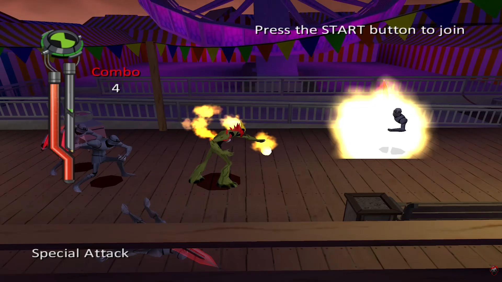
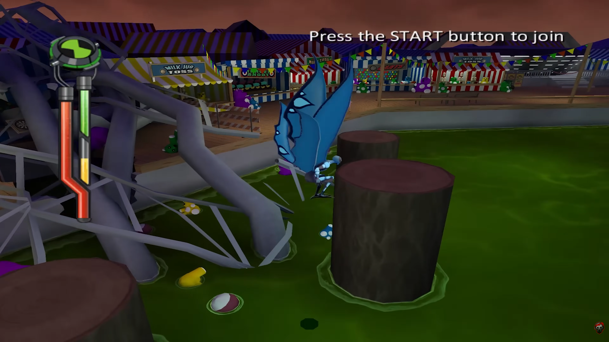
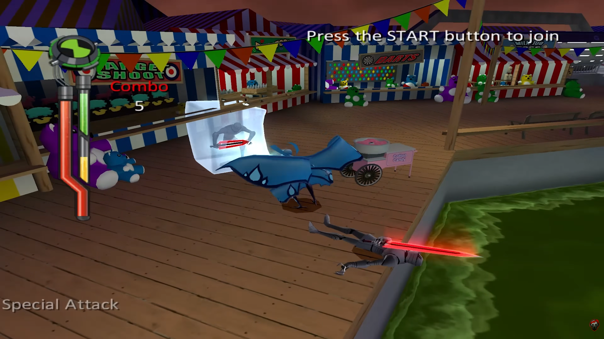

# Especificação da Implementação

> [!CAUTION]
> - Você <ins>**não pode utilizar ferramentas de IA para escrever esta
>   especificação**</ins>

## Integrantes da dupla

- **Aluno 1 - Nome**: Pedro Henrique Moreira de Andrade Jacinto
- **Aluno 1 - Cartão UFRGS**: 00587135

- **Aluno 2 - Nome**: João Pedro Simon Figueiró
- **Aluno 2 - Cartão UFRGS**: 00589908

## Detalhes do que será implementado

- **Título do trabalho**: Ben 10 Força Alienígena Remastered (OpenGL version)
- **Parágrafo curto descrevendo o que será implementado**: Iremos implementar os primeiros minutos de gameplay do jogo Ben 10 Alien Force, originalmente lançado para Playstation 2. A jogabilidade do jogo é bem simples, temos **Combate** e **Plataforma**.
  - **Combate:** A fim de prosseguir na fase, Ben deverá enfrentar *waves* de inimigos, que surgem em diferentes partes da fase. Para isso, temos 2 possíveis aliens a serem escolhidos, cada um com sua peculiaridade. **Fogo Fátuo**, um alien de fogo centrado em combate no geral. Sua habilidade especial é jogar uma bola de fogo para frente, causando forte dano aos inimigos atingidos. Temos também o **Friagem**, um alien de gelo que possui um uso mais interessante que o anterior. Ele possui uma habilidade passiva que o permite relizar um pulo duplo, facilitando a passagem em seções de plataforma. Também possui uma habilidade para o combate, que congela os inimigos a sua frente com um sopro gélido, mantendo-os imóveis por um curto período de tempo.
  - **Plataforma:** Entre os combates, o jogador precisa atravessar uma série de obstáculos para prosseguir. Nessa parte, o uso do Friagem é perfeito pois permite realizar um pulo duplo, o que facilita bastante.

Para o escopo deste trabalho, pensamos em ter 2 momentos implementados. O primeiro seria justamente uma *gameplay* em terceira pessoa contendo combate e plataforma. A fase seguiria para um segundo local, onde a perspectiva de jogabilidade mudará, teremos uma câmera fixa em pontos específicos da fase. Essa segunda parte seria principalmente focada no combate, não contendo muitas plataformas. 

## Especificação visual

### Vídeo - Link

<!-- > [!IMPORTANT]
> - Coloque aqui um link para um vídeo que mostre a aplicação gráfica
>   de referência que você vai implementar. **Sua implementação deverá
>   ser o mais parecido possível com o que é mostrado no vídeo (mais
>   detalhes abaixo).**
> - **Você não pode escolher como referência: (1) algum trabalho realizado
>   por outros alunos desta disciplina, em semestres anteriores. (2) Minecraft.**
> - Por exemplo, você pode colocar um vídeo de um jogo que você gosta,
>   e seu trabalho final será uma re-implementação do jogo.
> - O vídeo pode ser um link para YouTube, Google Drive, ou arquivo mp4 dentro
>   do próprio repositório. Mas, garanta que qualquer um tenha
>   permissão de acesso ao vídeo através deste link. -->

[Link para vídeo de demonstração](https://www.youtube.com/watch?v=NFzR4qwJwrA)

### Vídeo - Timestamp

<!-- > [!IMPORTANT]
> - Coloque aqui um **intervalo de ~30 segundos** do vídeo acima, que
>   será a base de comparação para avaliar se o seu trabalho final
>   conseguiu ou não reproduzir a referência. -->

- **Timestamp inicial**: 6:07
- **Timestamp final**: 6:37

Nesse timestamp, começamos vendo a jogabilidade da plataforma, com o jogador usando o Friagem. Após isso temos um combate com o mesmo alien, tendo o uso da habilidade especial de Sopro Gélido.

### Imagens
<!-- 
> [!IMPORTANT]
> - Coloque aqui **três imagens** capturadas do vídeo acima, que você
>   irá usar como ilustração para as explicações que vêm abaixo. -->

## Especificação textual

Para cada um dos requisitos abaixo (detalhados no [Enunciado do Trabalho final - Moodle](https://moodle.ufrgs.br/mod/assign/view.php?id=6018620)), escreva um parágrafo **curto** explicando como este requisito será atendido, apontando itens específicos do vídeo/imagens que você incluiu acima que atendem estes requisitos.

### Malhas poligonais complexas
Implementaremos os dois modelos de aliens presentes nas imagens, alem de objetos de fundo, a fim de povoar o cenário. Como visto no vídeo também, cada inimigo possui *drops*, então teremos modelos para isso também.

### Transformações geométricas controladas pelo usuário
Para a movimentação do personagem ao longo da fase, teremos transformações geométricas mudando sua orientação e posição usando inputs do usuário. Inicialmente planejamos a jogabilidade para PC, com movimentação usando *WASD*, *Space* para pulos e *E* para habiliades especiais.

### Diferentes tipos de câmeras
Implementaremos inicialmente uma câmera em terceira pessoa seguindo o jogador, como visto no vídeo do jogo original. A fim de abraçar um segundo tipo de câmera, implementaremos uma câmera fixa em alguns pontos da fase, o que pode complicará um pouco a questão do cálculo de movimentação, mas trás uma variação na jogabiildade. Esse modelo de câmera não está presente originalmente no jogo. Use [esse vídeo](https://www.youtube.com/watch?v=SzCvAW4Vaec) como uma base para para ver uma demonstração de câmera fixa (1:24).

### Instâncias de objetos
Usaremos vários modelos para povoar o cenário, muitos deles do mesmo objeto, como barracas de pipoca e bancos. Aleḿ disso, se contarmos os inimigos como objetos, teremos várias instâncias deles aparecendo ao decorrer da *gameplay*. 

### Testes de intersecção
Teremos testes de intersecção entre objetos, principalmente na parte do combate. Temos habilidades especiais que criam *hit zones* diferentes do sprite do jogador, então implementaremos a lógica para calcular o *hit* desses ataques.

### Modelos de Iluminação em todos os objetos
Teremos inicialmente um modelo de ilumincação global. Além disso, implementaremos uma iluminação com o jogador, dependendo do alien que está selecionado. Se Fogo Fátuo for o jogador atual, então um brilho amarelo semelhante a fogo ira ser aplicado em um raio próximo a sua posição. O mesmo se repetindo para Friagem, mudando apenas a cor para um azul claro, simulando um brilho mais gelado.

### Mapeamento de texturas em todos os objetos
Iremos procurar os modelos originais do jogo, que possuem texturas em imagens. Caso isso não ocorra, procuraremos semelhantes para não perder a essência da jogabilidade e da ambientação. Para o *background* usaremos de uma textura fixa em repetição, caracterizando a iluminação global. 

### Movimentação com curva Bézier cúbica
Prevemos utilizar de uma curva de Bézier cúbica para a movimentação dos inimigos. A medida que o tempo passa, eles suavemente irão se aproximar do jogador. Além disso, podemso ter a movimentação de elementos do cenário em um loop, mapeado por uma curva.

### Animações baseadas no tempo ($\Delta t$)
Todas as nossas animações, junto do cálculo da posição do jogador e inimigos irão usar o $\Delta t$ nas contas. Queremos uma experiência suave e que independa do software utilizado para rodar o jogo.

## Limitações esperadas

<!-- > [!IMPORTANT]
> - Coloque aqui uma lista de detalhes visuais ou de interação que
>   aparecem no vídeo e/ou imagens acima, mas que você **não pretende
>   implementar** ou que você **irá implementar parcialmente**.
> - Para cada item, **explique por que** não será implementado ou por
>   que será implementado parcialmente. -->

Prevemos algumas limitações para este trabalho:
- Quanto ao combate, o vídeo mostra diferentes *combos*. Iremos cortar essa parte para um combate masi simples com apenas um ataque normal e uma habilidade.
- O jogo conta com diferentes menus, iremos apenas ter um menu inicial.
- Na gameplay temos um medidor de especial, que limita o uso dos aliens. O jogador na nossa versão poderá usar qualquer um dos aliens a qualquer momento, trocando eles com uma tecla.
- Temos também vários tipos de inimigos no jogo, usaremos apenas o mais simples.
- Dependendo da fluidez do desenvolvimento, planejamos fazer uma fase mais curta, a fim do jogador experenciar as duas câmeras.
- Temos também a presença de vários coletáveis, planejamos deixar apenas os drops de vida dos inimigos. 